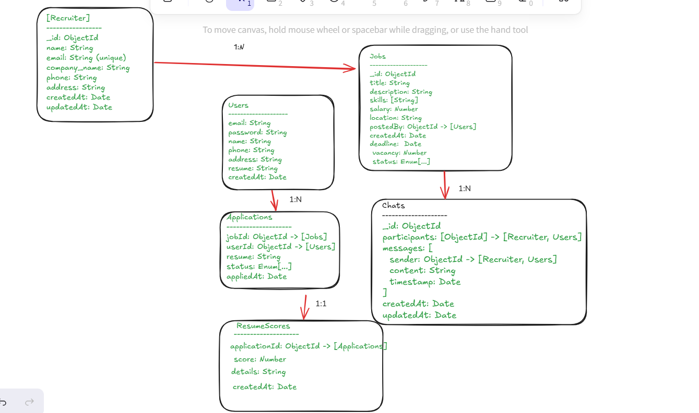

# JobSphere Backend

This is the backend service for the JobSphere platform, providing RESTful APIs for job seekers and recruiters to manage jobs, applications, chats, and resume scoring.

## Table of Contents

- [Features](#features)
- [Tech Stack](#tech-stack)
- [Project Structure](#project-structure)
- [Database Models](#database-models)
- [API Modules](#api-modules)
- [Setup & Running](#setup--running)
- [Environment Variables](#environment-variables)

---

## Features

- User and recruiter registration, authentication, and profile management
- Job posting and management by recruiters
- Job application by users
- Resume upload and AI-based resume scoring
- Chat system between users and recruiters
- JWT-based authentication and token blacklisting

## Tech Stack

- Node.js, Express.js
- MongoDB, Mongoose
- JWT for authentication
- Multer for file uploads
- Nodemailer for email
- Express-validator for validation

## Project Structure

```
backend/
│
├── app.js                # Express app setup and route mounting
├── server.js             # HTTP server entry point
├── package.json
├── .env
├── README.md
│
├── controllers/          # Route handlers (business logic)
│   ├── application.controller.js
│   ├── chat.controller.js
│   ├── job.controller.js
│   ├── recruiter.controller.js
│   ├── resumeScore.controller.js
│   └── user.controller.js
│
├── db/
│   └── db.js             # MongoDB connection logic
│
├── middlewares/
│   └── auth.js           # JWT authentication middleware
│
├── models/               # Mongoose schemas/models
│   ├── application.model.js
│   ├── blacklistToken.model.js
│   ├── chat.model.js
│   ├── job.model.js
│   ├── recruiter.model.js
│   ├── resumeScore.model.js
│   └── user.model.js
│
├── routes/               # Express route definitions
│   ├── application.routes.js
│   ├── chat.routes.js
│   ├── job.routes.js
│   ├── recruiter.routes.js
│   ├── resume.routes.js
│   └── user.routes.js
│
└── uploads/
    └── resumes/          # Uploaded resume files
```

## Database Models

The main entities and their relationships are:

- **User**: Job seeker, can apply to jobs and chat with recruiters.
- **Recruiter**: Can post jobs and chat with users.
- **Job**: Posted by a recruiter, can have multiple applications.
- **Application**: Created by a user for a job, has a 1:1 relationship with ResumeScore.
- **ResumeScore**: AI-generated score for an application.
- **Chat**: Between a user and a recruiter, contains messages.

See the ER diagram for details.

## API Modules

- **User APIs**: Registration, login, logout, profile, password reset ([routes/user.routes.js](routes/user.routes.js))
- **Recruiter APIs**: Registration, login, logout, profile, password reset ([routes/recruiter.routes.js](routes/recruiter.routes.js))
- **Job APIs**: CRUD for jobs ([routes/job.routes.js](routes/job.routes.js))
- **Application APIs**: Apply to jobs, manage applications ([routes/application.routes.js](routes/application.routes.js))
- **Resume Score APIs**: Generate and fetch resume scores ([routes/resume.routes.js](routes/resume.routes.js))
- **Chat APIs**: Create chat, send messages ([routes/chat.routes.js](routes/chat.routes.js))

## Setup & Running

1. **Install dependencies:**
   ```sh
   npm install
   ```

2. **Configure environment variables:**  
   Copy `.env.example` to `.env` and fill in the required values (see below).

3. **Start the server:**
   ```sh
   npm run server
   ```
   The server will run on `http://localhost:5000` by default.

## Environment Variables

Create a `.env` file in the backend folder with the following keys:

```
PORT=5000
MONGODB_URI=your_mongodb_connection_string
JWT_SECRET=your_jwt_secret
GMAIL_USER=your_gmail_address
GMAIL_PASS=your_gmail_app_password
NODE_ENV=development
```


## API Endpoints

### User Routes (`/users`)
- `POST /register`  
  Register a new user (job seeker). Requires name, email, password, phone, address, and resume file upload.
- `POST /login`  
  Login as a user. Requires email and password.
- `GET /logout`  
  Logout the current user (JWT token blacklisting).
- `POST /forgot-password`  
  Request a password reset email.
- `POST /reset-password`  
  Reset password using a token.
- `GET /profile`  
  Get the authenticated user's profile.
- `GET /verify-email/:token`  
  Verify user email using the token sent via email.

### Recruiter Routes (`/recruiters`)
- `POST /register`  
  Register a new recruiter. Requires name, email, password, phone, company name, and address.
- `POST /login`  
  Login as a recruiter. Requires email and password.
- `GET /logout`  
  Logout the current recruiter (JWT token blacklisting).
- `GET /profile`  
  Get the authenticated recruiter's profile.
- `POST /forgot-password`  
  Request a password reset email.
- `POST /reset-password`  
  Reset password using a token.
- `GET /verify-email/:token`  
  Verify recruiter email using the token sent via email.

### Job Routes (`/jobs`)
- `POST /`  
  Create a new job (recruiter only).
- `GET /`  
  Get all jobs (with optional filters: status, location, jobType, role, pagination).
- `GET /:id`  
  Get a job by its ID.
- `PUT /:id`  
  Update a job (recruiter only, must be the owner).
- `DELETE /:id`  
  Delete a job (recruiter only, must be the owner).

### Application Routes (`/applications`)
- `POST /`  
  Apply to a job (user only).
- `GET /`  
  Get all applications for jobs posted by the recruiter (recruiter only).
- `GET /:applicationId`  
  Get a specific application by ID (user or recruiter).
- `PUT /:applicationId/status`  
  Update the status of an application (recruiter only).
- `DELETE /:applicationId`  
  Delete an application (user or recruiter).

### Resume Score Routes (`/resume-scores`)
- `POST /`  
  Generate a resume score for an application (recruiter only).
- `GET /:applicationId`  
  Get the resume score for a specific application (user or recruiter).

### Chat Routes (`/chats`)
- `POST /`  
  Create a chat between a user and a recruiter.
- `GET /`  
  Get all chats for the authenticated user or recruiter.
- `GET /:chatId`  
  Get a specific chat by ID (must be a participant).
- `POST /:chatId/message`  
  Send a message in a chat (must be a participant).

---

**Note:**  
- Most routes require authentication via JWT in the `Authorization` header as `Bearer <token>`.
- See the respective route files in [`routes/`](routes/) for validation and detailed logic.


## Notes

- Resume files are stored in `uploads/resumes/`.
- All API endpoints are prefixed (e.g., `/users`, `/jobs`, `/applications`, etc.).
- Authentication uses JWT in the `Authorization` header as `Bearer <token>`.
- See individual route files for detailed API endpoints.

## ✅ API Testing Summary

All **User**, **Recruiter**, and **Job** routes have been thoroughly tested using **Postman**. The following endpoints were verified and confirmed to be working as expected:

---

### 🔐 Authentication Routes
- `POST /register` – Register a new user/recruiter  
- `POST /login` – Login with email and password  
- `GET /logout` – Logout the current session  

---

### 🔁 Password Management
- `POST /forgot-password` – Request password reset link  
- `POST /reset-password/:token` – Reset password using token  

---

### 👤 Profile & Verification
- `GET /profile` – Retrieve user/recruiter profile  
  _Middleware_: `authenticateRecruiter`
- `GET /verify-email/:token` – Verify email using token  

---

### 💼 Job Management Routes
> These routes are protected and require recruiter authentication.

- `POST /jobs` – Create a new job  
  _Middleware_: `authenticateRecruiter`, `jobValidationRules`  
- `GET /jobs` – Retrieve all active jobs  
- `GET /jobs/:id` – Get a job by ID  
- `PUT /jobs/:id` – Update a job by ID  
  _Middleware_: `authenticateRecruiter`, `jobValidationRules`  
- `DELETE /jobs/:id` – Delete a job by ID  
  _Middleware_: `authenticateRecruiter`  

---

✅ **User Routes testing Done**
✅ **Recruiter Routes testing Done**
✅ **Job Routes testing Done**
✅ **Application Routes testing Done**
✅ **Resume Score Routes testing Done**
✅ **create chat.get all chats done**
❌**get chat id error**


---

For more details, see the code in the respective folders and files.